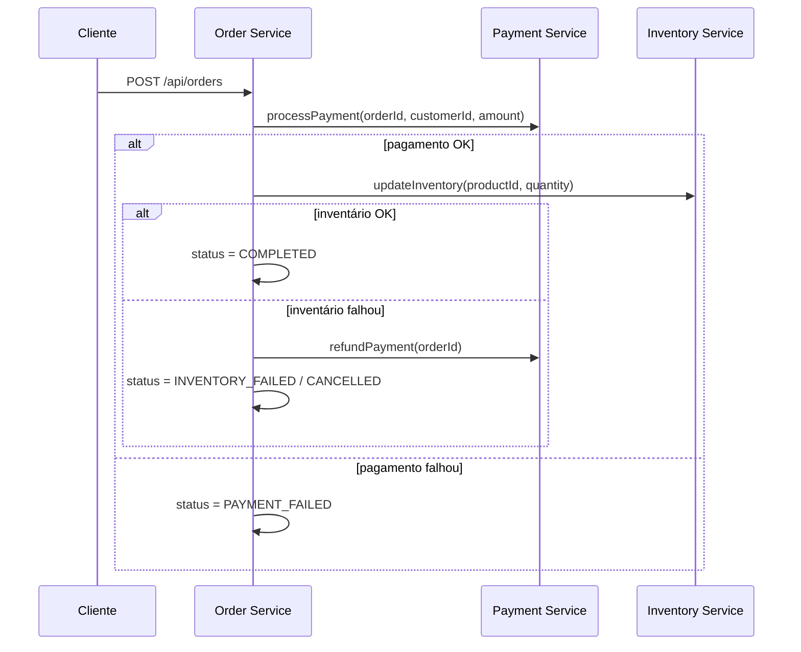

# SAGA Pattern na Prática com Spring Boot 🎭🚀


E aí, devs! BoraPraticar SAGA de um jeito leve, direto e prático? 😎 Neste BoraPraticar vamos montar e entender um fluxo SAGA completo com três microserviços: `order-service`, `payment-service` e `inventory-service`. Além do passo a passo, tem benefícios, quando usar (e quando não!), códigos essenciais e curls para testar cenários felizes e compensatórios. Repo: https://github.com/devsdofuturobr/saga.git


### SAGA em dois sabores 🍦
- Orquestrada (command/HTTP): um orquestrador central coordena cada passo — no nosso caso, o `order-service` chama `payment` e `inventory` e aplica compensações quando necessário.
  - Prós: fluxo explícito, debugging simples, ótimo para demos e times iniciando.
  - Contras: acoplamento ao orquestrador, risco de ponto único de falha, precisa de cuidado para escalar.
- Coreografada (eventos): não há orquestrador; cada serviço publica eventos e reage aos de outros (ex.: `OrderCreated` → `PaymentProcessed` → `InventoryReserved`), geralmente com Outbox + Kafka/RabbitMQ.
  - Prós: baixo acoplamento, mais escalável e resiliente.
  - Contras: rastreabilidade e observabilidade exigem mais esforço, consistência é eventual, requer mensageria e padrões como Outbox.

## Bora Praticar hoje SAGA Orquestrado? 🧠
- SAGA coordena transações locais entre microserviços com passos e compensações.
- Use quando precisa de resiliência e consistência eventual; evite quando precisa de consistência forte imediata.
- Aqui tem código pronto, endpoints, curls e compensações para testar rápido.

## Tecnologias Utilizadas

- Java 21
- Spring Boot 3.2.0
- Spring Data JPA
- Spring Cloud OpenFeign (comunicação entre serviços)
- H2 Database (banco em memória)
- Maven

## Endpoints das API

### Order Service
- `POST /api/orders` - Criar novo pedido
- `GET /api/orders/{id}` - Buscar pedido por ID
- `GET /api/orders` - Listar todos os pedidos
- `GET /api/orders/customer/{customerId}` - Buscar pedidos por cliente

### Payment Service
- `POST /api/payments/process` - Processar pagamento
- `POST /api/payments/refund` - Processar reembolso

### Inventory Service
- `POST /api/inventory/update` - Atualizar inventário
- `POST /api/inventory/compensate` - Compensar inventário
- `GET /api/inventory/products` - Listar todos os produtos
- `GET /api/inventory/products/available` - Listar produtos disponíveis
- `GET /api/inventory/products/{productId}` - Buscar produto por ID
- `POST /api/inventory/products` - Criar novo produto
- `PUT /api/inventory/products/{productId}/stock` - Atualizar estoque

## Swagger UI 🔗
- Swagger UI
  - `http://localhost:8080/swagger-ui/index.html`
  - `http://localhost:8081/swagger-ui/index.html`
  - `http://localhost:8082/swagger-ui/index.html`

## Arquitetura

O sistema consiste em três microserviços principais:

1. **Order Service** (Porta 8080) - Gerencia pedidos e orquestra o padrão SAGA
2. **Payment Service** (Porta 8081) - Processa pagamentos e reembolsos
3. **Inventory Service** (Porta 8082) - Gerencia estoque de produtos

## Fluxo SAGA

O fluxo segue o padrão SAGA com compensação:

1. **Criação do Pedido**: O Order Service cria um pedido com status PENDING
2. **Processamento de Pagamento**: Solicita ao Payment Service para processar o pagamento
3. **Atualização de Inventário**: Solicita ao Inventory Service para atualizar o estoque
4. **Compensação**: Se algum passo falhar, as ações anteriores são compensadas

### Estados do Pedido

- `PENDING` - Pedido criado
- `PAYMENT_PROCESSING` - Pagamento em processamento
- `PAYMENT_COMPLETED` - Pagamento concluído
- `PAYMENT_FAILED` - Pagamento falhou
- `INVENTORY_PROCESSING` - Inventário em processamento
- `INVENTORY_COMPLETED` - Inventário atualizado
- `INVENTORY_FAILED` - Falha na atualização do inventário
- `COMPLETED` - Pedido concluído com sucesso
- `CANCELLED` - Pedido cancelado

## Diagrama do Fluxo (Mermaid) 🗺️


---

## O que vamos construir 🧩
- `Order Service` (8080): orquestrador da SAGA, cria pedidos e coordena os passos
- `Payment Service` (8081): processa pagamentos e reembolsos
- `Inventory Service` (8082): atualiza e compensa estoque

Fluxo resumido:
1) Cria pedido (`PENDING`)
2) Processa pagamento (`PAYMENT_*`)
3) Atualiza estoque (`INVENTORY_*`)
4) Sucesso → `COMPLETED`; falha → compensação e `CANCELLED`

Estados de pedido: `PENDING`, `PAYMENT_PROCESSING`, `PAYMENT_COMPLETED`, `PAYMENT_FAILED`, `INVENTORY_PROCESSING`, `INVENTORY_COMPLETED`, `INVENTORY_FAILED`, `COMPLETED`, `CANCELLED`.

---

## Por que usar SAGA? ✨
- Consistência eventual com autonomia por serviço
- Resiliência: cada etapa tem compensação definida
- Escalabilidade: transações locais, comunicação leve
- Observabilidade e auditoria de cada etapa

## Checklist SAGA ✅
- [ ] Cada passo tem uma compensação definida
- [ ] Estados do pedido cobrem sucesso e falhas
- [ ] Comunicação remota simples e com tratamento de erro
- [ ] Scripts/collections para reproduzir cenários
- [ ] Logs claros para entender o fluxo

## Quando evitar SAGA? 🛑
- Você precisa de consistência forte e imediata em uma única operação
- O domínio é simples e cabe em uma transação local
- Latência ultrabaixa e complexidade operacional não são aceitáveis
- O time ainda não tem maturidade para lidar com falhas e compensações

---

## Códigos que importam 🧠

Orquestração da SAGA (Order Service):

```java
// order-service/src/main/java/com/saga/orderservice/service/SagaOrchestrator.java
@Slf4j
@Service
@RequiredArgsConstructor
public class SagaOrchestrator {
    private final PaymentServiceClient paymentServiceClient;
    private final InventoryServiceClient inventoryServiceClient;
    private final OrderRepository orderRepository;

    public void startOrderSaga(Order order) {
        log.info("Starting SAGA for order: {}", order.getId());
        try {
            updateOrderStatus(order.getId(), OrderStatus.PAYMENT_PROCESSING);
            boolean paymentProcessed = paymentServiceClient.processPayment(
                    order.getId(), order.getCustomerId(), order.getTotalAmount());
            if (!paymentProcessed) {
                updateOrderStatus(order.getId(), OrderStatus.PAYMENT_FAILED);
                return;
            }
            updateOrderStatus(order.getId(), OrderStatus.PAYMENT_COMPLETED);

            updateOrderStatus(order.getId(), OrderStatus.INVENTORY_PROCESSING);
            boolean inventoryUpdated = inventoryServiceClient.updateInventory(
                    order.getProductId(), order.getQuantity());
            if (!inventoryUpdated) {
                // compensação
                paymentServiceClient.refundPayment(order.getId());
                updateOrderStatus(order.getId(), OrderStatus.INVENTORY_FAILED);
                return;
            }
            updateOrderStatus(order.getId(), OrderStatus.INVENTORY_COMPLETED);
            updateOrderStatus(order.getId(), OrderStatus.COMPLETED);
        } catch (Exception e) {
            log.error("Error in SAGA for order {}: {}", order.getId(), e.getMessage());
            handleSagaFailure(order);
        }
    }

    private void handleSagaFailure(Order order) {
        try {
            if (order.getStatus() == OrderStatus.PAYMENT_COMPLETED ||
                order.getStatus() == OrderStatus.INVENTORY_PROCESSING ||
                order.getStatus() == OrderStatus.INVENTORY_FAILED) {
                paymentServiceClient.refundPayment(order.getId());
            }
            updateOrderStatus(order.getId(), OrderStatus.CANCELLED);
        } catch (Exception ignored) {}
    }

    private void updateOrderStatus(Long orderId, OrderStatus status) {
        orderRepository.findById(orderId).ifPresent(o -> {
            o.setStatus(status);
            orderRepository.save(o);
        });
    }
}
```

Controller do Order (criar pedido):

```java
// order-service/src/main/java/com/saga/orderservice/controller/OrderController.java
@PostMapping
public ResponseEntity<OrderResponse> createOrder(@Valid @RequestBody OrderRequest request) {
    OrderResponse response = orderService.createOrder(request);
    return new ResponseEntity<>(response, HttpStatus.CREATED);
}
```

Clientes Feign (comunicação remota):

```java
// order-service/src/main/java/com/saga/orderservice/client/PaymentServiceClient.java
@FeignClient(name = "payment-service", url = "http://localhost:8081")
public interface PaymentServiceClient {
    @PostMapping("/api/payments/process")
    boolean processPayment(@RequestParam("orderId") Long orderId,
                           @RequestParam("customerId") String customerId,
                           @RequestParam("amount") BigDecimal amount);

    @PostMapping("/api/payments/refund")
    boolean refundPayment(@RequestParam("orderId") Long orderId);
}
```

---

## Endpoints principais 🛣️

Order Service (8080)
- POST `/api/orders`
- GET `/api/orders/{id}`
- GET `/api/orders`
- GET `/api/orders/customer/{customerId}`

Payment Service (8081)
- POST `/api/payments/process?orderId=...&customerId=...&amount=...`
- POST `/api/payments/refund?orderId=...`

Inventory Service (8082)
- POST `/api/inventory/update?productId=...&quantity=...`
- POST `/api/inventory/compensate?productId=...&quantity=...`
- GET `/api/inventory/products`
- GET `/api/inventory/products/available`
- GET `/api/inventory/products/{productId}`

Swagger UI (dev-friendly):
- http://localhost:8080/swagger-ui/index.html
- http://localhost:8081/swagger-ui/index.html
- http://localhost:8082/swagger-ui/index.html

H2 Console (para ver o banco):
- `order`: http://localhost:8080/h2-console (jdbc:h2:mem:orderdb)
- `payment`: http://localhost:8081/h2-console (jdbc:h2:mem:paymentdb)
- `inventory`: http://localhost:8082/h2-console (jdbc:h2:mem:inventorydb)
Username: `sa` • Password: vazio

---

## Execução rápida ▶️
- Terminais: `mvn spring-boot:run` dentro de cada serviço

---

## Bora testar com curl 🧪

Happy path (pedido confirmado):

```bash
curl -X POST http://localhost:8080/api/orders \
  -H "Content-Type: application/json" \
  -d '{
    "customerId": "CUST-123",
    "productId": "PROD-001",
    "quantity": 2,
    "totalAmount": 1399.98
  }'

# supondo que o ID retornado seja 1
curl http://localhost:8080/api/orders/1
curl http://localhost:8082/api/inventory/products/PROD-001
```

Cenário compensatório (falha no inventário → reembolso):

```bash
# quantidade maior que o estoque para forçar falha de inventário
curl -X POST http://localhost:8080/api/orders \
  -H "Content-Type: application/json" \
  -d '{
    "customerId": "CUST-123",
    "productId": "PROD-001",
    "quantity": 999,
    "totalAmount": 999999.99
  }'

# ver status do pedido (tende a CANCELLED após compensação)
curl http://localhost:8080/api/orders/2

# conferir inventário e (se pagamento tiver completado) reembolso aplicado
curl http://localhost:8082/api/inventory/products/PROD-001
```

Falha de pagamento (aleatória, ~10%):

```bash
# recrie pedidos e observe logs/status; quando o pagamento falha, o pedido fica como PAYMENT_FAILED
curl -X POST http://localhost:8080/api/orders \
  -H "Content-Type: application/json" \
  -d '{
    "customerId": "CUST-456",
    "productId": "PROD-002",
    "quantity": 1,
    "totalAmount": 1299.99
  }'
```

Manual (se quiser chamar direto):

```bash
# pagamento
curl -X POST "http://localhost:8081/api/payments/process?orderId=1&customerId=CUST-123&amount=1399.98"

# reembolso
curl -X POST "http://localhost:8081/api/payments/refund?orderId=1"
```

---

## Logs e Monitoramento

Cada serviço gera logs detalhados do processo SAGA:

```bash
# Ver logs do Order Service
tail -f order-service/logs/spring.log

# Ver logs do Payment Service
tail -f payment-service/logs/spring.log

# Ver logs do Inventory Service
tail -f inventory-service/logs/spring.log
```

---

## Erros comuns e dicas 🪛
- Ciclo de beans: evite injetar `OrderService` dentro do orquestrador; use `OrderRepository` para atualizar status.
- Idempotência: compensações devem tolerar reexecuções sem efeitos colaterais indesejados.
- Timeouts e retries: configure limites e políticas de reexecução para chamadas remotas.
- Observabilidade: registre transições de estado e correlações por `orderId`.

---

## BoraPraticar: takeaways 🎯
- SAGA é sobre coordenar transações locais com compensações pensadas
- Troque “transação distribuída gigante” por “etapas menores + rollback inteligente”
- Observabilidade e logs são parte do jogo
- Nem todo problema pede SAGA — seja intencional 😉

Repo completo para você clonar e brincar: https://github.com/devsdofuturobr/saga.git

---

## Próximos Passos

Para uma implementação de produção, considere:

1. **Mensageria**: Substituir comunicação REST por mensageria (RabbitMQ, Kafka)
2. **Banco de Dados Persistente**: Usar PostgreSQL, MySQL ou MongoDB
3. **Service Discovery**: Implementar com Kubernetes Service Discovery
4. **API Gateway**: Adicionar um gateway para gerenciar as APIs
5. **Monitoramento**: Implementar Prometheus, Grafana ou similar
6. **Testes**: Adicionar testes unitários e de integração
7. **Containerização**: Criar Docker containers para cada serviço
8. **Orquestração**: Usar Kubernetes para gerenciar containers

---

## Valeu por chegar até aqui! 🙌
- Se curtiu este BoraPraticar, deixa um comentário com suas dúvidas ou ideias.
- Compartilhe com a galera e ajuda a levar SAGA para mais devs! 🔄✨
